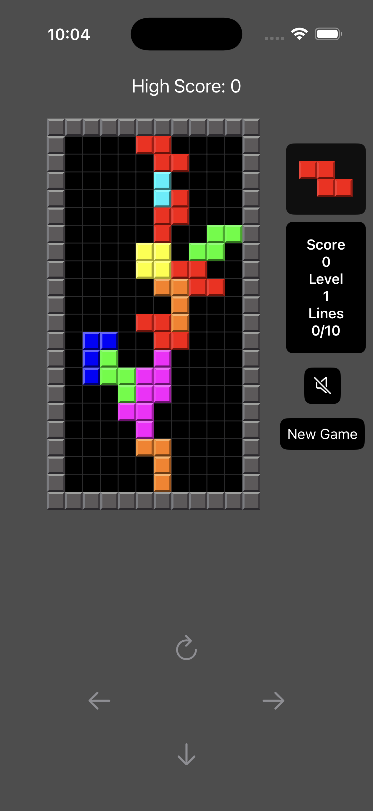
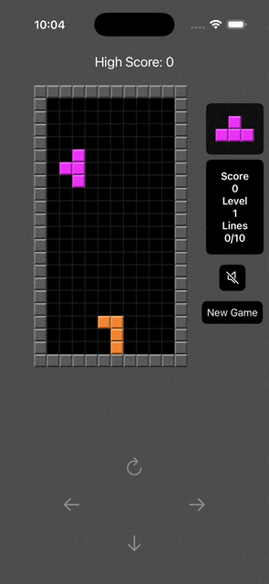

# 🚀 Tetris

A classic Tetris game for iPhone, built with SwiftUI and The Composable Architecture (TCA) for a modern, responsive, and testable gaming experience.
Featuring an AI-powered Demo Mode driven by a neural network to showcase intelligent gameplay.

## 📸 Screenshots

<div align="center">
  
  
</div>

## ✨ Features

**Classic Tetris Gameplay:** Stack falling tetrominoes to clear lines, score points, and progress through increasing difficulty levels.

**AI-Powered Demo Mode**: Watch an intelligent neural network play Tetris autonomously, optimizing moves based on learned strategies to maximize line clears and minimize board clutter.

**Responsive Controls:** Intuitive touch and swipe controls optimized for iPhone.

**High Score Tracking:** Save and display your top scores locally.

**Unit Test Coverage:** 94% test coverage for robust and reliable code.

## 🧠 AI and Neural Network

The Demo Mode leverages a neural network to make intelligent move decisions. The AI evaluates the game state using a feature extractor that analyzes key metrics.
The neural network is trained using a genetic algorithm through self-play, optimizing weights to prioritize moves that lead to higher scores and longer games. The `getBestMove` function calculates the optimal position and rotation for each tetromino based on these features, providing a compelling demonstration of AI-driven gameplay.

## 🛠 Tech Stack

- **Swift 6.0+** - Latest Swift language features and concurrency model
- **SwiftUI** - Modern declarative UI framework with smooth animations
- **The Composable Architecture (TCA)** - Modular, scalable, and testable state management
- **Swift Concurrency** - Async/await, actors, and structured concurrency for game loops
- **Neural Network** - Custom implementation for AI-driven gameplay using genetic algorithms
- **MainActor** - Thread-safe UI updates with proper actor isolation

## 🏗 Project Structure
```bash
TetrisApp/
 Sources/
 ├── App/                       # Main app entry point with @main
 ├── Core/
 │    ├── Models/              # Game state, tetrominoes, score models
 │    ├── Services/            # Game logic, neural network services
 │    │   └── NeuralNetwork/   # AI services with Swift 6 concurrency
 │    └── Utils/               # Helpers, extensions, and Sendable types
 │
 ├── Features/
 │    └── Tetris/              # Game board, controls, and UI with @MainActor
 │
 ├── SharedUI/
 │    └── Components/          # Reusable UI components with actor isolation
 │
 ├── Resources/
 │    └── Assets.xcassets      # Image assets for tetrominoes and UI
 │
 └── Tests/
      ├── UnitTests/           # Unit tests with Swift Concurrency support
      └── UITests/             # UI tests for game board and controls
```

## 🚀 Installation

### Prerequisites

* **Xcode 16** or later (Swift 6 support required)
* **iOS 18** or later for Swift 6 compatibility
* **Swift 6 Language Mode** enabled in project settings

### Steps

1. **Clone the repository:**
```bash
git clone https://github.com/karkadi/TetrisApp.git
cd TetrisApp
```

2. **Open the project in Xcode 16+** - The project requires Swift 6 features

3. **Enable required capabilities:**
   - Game Center under the Capabilities tab
   - Ensure Swift 6 language mode is enabled

4. **Build and run:**
   - Select an iPhone simulator or device as the target
   - Build and run the app (Cmd + R)

## 🔄 Migration to Swift 6

This project has been fully migrated to Swift 6 with the following key improvements:

### Concurrency Updates:
- **@MainActor** isolation for all UI components and view models
- **Async/await** replacing legacy completion handlers for game loops
- **Sendable** compliance for cross-actor data types in neural network
- **Structured concurrency** with proper task management
- **Actor isolation** for thread-safe state management in TCA

## 🎯 Swift 6 Features Utilized

- **Complete Concurrency Checking** - Strict actor isolation enforcement
- **Non-Sendable Type Safety** - Protected cross-actor data access
- **Structured Task Management** - Proper cancellation and lifecycle
- **MainActor Integration** - Thread-safe UI updates throughout the app

## 📋 Roadmap

- [ ] Enhance AI training with more sophisticated algorithms and real-time feedback
- [ ] Integrate Game Center for global leaderboards and achievements
- [ ] Increase unit test coverage to 90%+ with async test support
- [ ] Add customizable AI parameters for users to tweak Demo Mode behavior

## 🤝 Contribution

Pull requests are welcome! For major changes, please open an issue first to discuss what you'd like to change.

**Development Requirements**:
- Code must comply with Swift 6 concurrency rules
- Use @MainActor for all UI-related code
- Prefer async/await over completion handlers
- Ensure proper task cancellation in deinitializers
- Maintain Sendable compliance for cross-actor data

## 📄 License

This project is licensed under the MIT License.
See [LICENSE](LICENSE) for details.
