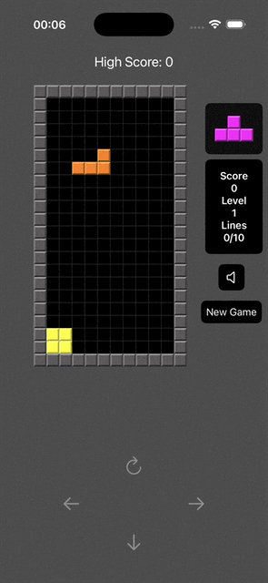

# 🚶‍♂️ Tetris

A classic Tetris game for iPhone, built with SwiftUI and The Composable Architecture (TCA) for a modern, responsive, and testable gaming experience.

## 📸 Screenshots

<div align="center">
  
  
</div>

## ✨ Features

**Classic Tetris Gameplay:** Stack falling tetrominoes to clear lines and score points.

**Demo Mode:** 

**Responsive Controls:** Intuitive touch and swipe controls optimized for iPhone.

**High Score Tracking:** Save and display your top scores locally.

**Unit Test Coverage:** 83% test coverage for robust and reliable code.

## 🛠 Tech Stack

**Swift:** 5.0+

**SwiftUI:** For UI, animations, and widgets

**The Composable Architecture (TCA):** For modular and testable state management

**Swift Concurrency (async/await):** For efficient game loop and background tasks

## 🏗 Project Structure
```bash
TetrisApp/
 Sources/
 ├── App/                       # Main app entry point
 ├── Core/
 │    ├── Models/              # Game state, tetrominoes, score models
 │    ├── Services/            # Game logic, Game Center integration
 │    └── Utils/               # Helpers and extensions
 │
 ├── Features/
 │    └── Tetris/              # Game board, controls, and UI
 │
 ├── SharedUI/
 │    └── Components/          # Reusable UI components (buttons, score displays)
 │
 ├── Resources/
 │    └── Assets.xcassets      # Image assets for tetrominoes and UI
 │
 └── Tests/
      ├── UnitTests/           # Unit tests for game logic and models
      └── UITests/             # UI tests for game board and controls
```
## 🚀 Installation
Prerequisites

* Xcode 16 or later

* iOS 18 or later

###Steps

1. Clone the repository:

```bash
git clone https://github.com/karkadi/TetrisApp.git
cd TetrisApp
```
2. Open the project in Xcode:

* Launch Xcode and open TetrisApp.xcodeproj.

3. Enable required capabilities:

* In Xcode, navigate to the project settings.

* Enable Game Center under the Capabilities tab for the app target.

4. Build and run:

* Select an iPhone simulator or device as the target.

* Build and run the app (Cmd + R) to install it on your device.

## 📋 Roadmap

* Add demo mode with AI-driven gameplay.

* Integrate Game Center for leaderboards and achievements.

* Increase unit test coverage 

## 🤝 Contribution

Pull requests are welcome! For major changes, please open an issue first to discuss what you’d like to change.

## 📄 License

This project is licensed under the MIT License.
See [LICENSE](LICENSE) for details.
